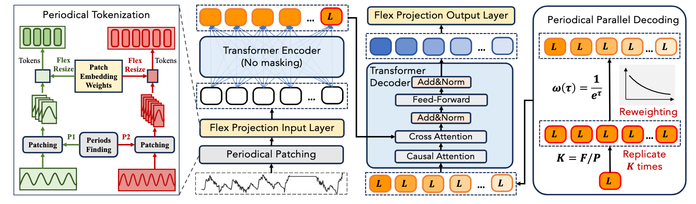

# LightGTS: A Lightweight General Time Series Forecasting Model

**This code is the official PyTorch implementation of our ICML'25 Poster Paper: LightGTS: A Lightweight General Time Series Forecasting Model**

if you find this project helpful, please don't forget to give it a ⭐ Star to show your support. Thank you!

🚩 News (2025.9) Released  pre-trained LightGTS-Mini on [HuggingFace](https://huggingface.co/DecisionIntelligence/LightGTS).

🚩 News (2025.5) LightGTS  has been accepted  by ICML 2025.

## Introduction :bulb:

we propose LightGTS, a lightweight general time series forecasting model designed from the perspective of consistent periodical modeling. To handle diverse scales and intrinsic periods in multi-source pre-training, we introduce Periodical Tokenization, which extracts consistent periodic patterns across different datasets with varying scales. To better utilize the periodicity in the decoding process, we further introduce Periodical Parallel Decoding, which leverage historical tokens to improve forecasting. Based on the two techniques above which fully leverage the inductive bias of periods inherent in time series, LightGTS uses a lightweight model to achieve outstanding performance on general time series forecasting. It achieves state-of-the-art forecasting performance on 9 real-world benchmarks in both zero-shot and full-shot setting with much better efficiency compared with existing time series foundation models



## Setup :wrench:

### **Installation**

Given a python environment (**note**: this project is fully tested under python 3.10.16), install the dependencies with the following command:

```bash
pip install -r requirements.txt
```

### Data preparation

#### Pretrain Data
We built a large-scale time series pretraining dataset for training LightGTS, which has been publicly released on [Google Drive](https://drive.google.com/drive/folders/1HOrsG4OKDm7P2ZgGlihx8GOQhtmuIfF1).

#### Evaluation Data
Prepare Data. You can obtained the well pre-processed datasets from [OneDrive](https://1drv.ms/u/c/801ce36c4ff3f93b/EVTDLHyvegpEn_Oxa6ZiuFIBjTsKk6m9JldUqWDqvrVCnQ?e=P2T3Vc) or [BaiduCloud](https://pan.baidu.com/s/1W7UoAWKZjoukSZ74FTipYA?pwd=2255). (This may take some time, please wait patiently.) Then place the downloaded data under the folder `./dataset`.

## Quick Start :rocket:

For different forecasting scenarios, use the following command:

### Zero-shot

```basic
        python -u zero_shot.py \
        --is_finetune $is_finetune \
        --is_transfer $is_transfer \
        --dset_finetune $dset_finetune \
        --is_half $is_half \
        --context_points 528 \
        --target_points $target_points \
        --batch_size $batch_size \
        --patch_len 48\
        --stride 48\
        --revin 1 \
        --e_layers $e_layers\
        --d_layers $d_layers\
        --n_heads 8 \
        --d_model 256 \
        --d_ff 512\
        --dropout 0.2\
        --head_drop 0.2 \
        --n_epochs_finetune $n_epochs_finetune\
        --n_epochs_freeze $n_epochs_freeze\
        --lr 1e-4 \
        --finetuned_model_id 1\
        --pretrained_model $pretrained_model\
        --model_type $model_type\ 
```

### Full-shot

```basic
        python -u finetune.py \
        --is_finetune $is_finetune \
        --is_transfer $is_transfer \
        --dset_finetune $dset_finetune \
        --is_half $is_half \
        --context_points 528 \
        --target_points $target_points \
        --batch_size $batch_size \
        --patch_len 48\
        --stride 48\
        --revin 1 \
        --e_layers $e_layers\
        --d_layers $d_layers\
        --n_heads 8 \
        --d_model 256 \
        --d_ff 512\
        --dropout 0.2\
        --head_drop 0.2 \
        --n_epochs_finetune $n_epochs_finetune\
        --n_epochs_freeze $n_epochs_freeze\
        --lr 1e-4 \
        --finetuned_model_id 1\
        --pretrained_model $pretrained_model\
        --model_type $model_type\
```

## Results

As shown in Table below LightGTS-mini consistently achieves the state-of-the-art performance, delivering an average MSE reduction of over 30% compared to the most competitive baselines. Remarkably, even with fewer parameters, LightGTS-tiny still outperforms across the majority of datasets, achieving an average MSE reduction of 27%.


As shown in Table 2, we present the results of the LightGTS in full-shot and zero-shot settings, and compare with other baselines in full-shot setting. Key observations are summarized as follows. First, as a general forecasting model, LightGTS achieves superior performance compared to the six state-of-the-art baselines with full-data training, achieving an average MSE reduction of 7%. Second, we observe that LightGTS in zero-shot setting significantly outperforms the baselines in full-shot setting across five datasets.


## Citation

If you find this repo useful, please cite our paper.

```
@inproceedings{wanglightgts,
  title={LightGTS: A Lightweight General Time Series Forecasting Model},
  author={Wang, Yihang and Qiu, Yuying and Chen, Peng and Shu, Yang and Rao, Zhongwen and Pan, Lujia and Yang, Bin and Guo, Chenjuan},
  booktitle={Forty-second International Conference on Machine Learning}
}
```
